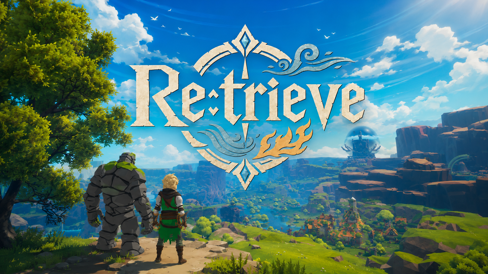
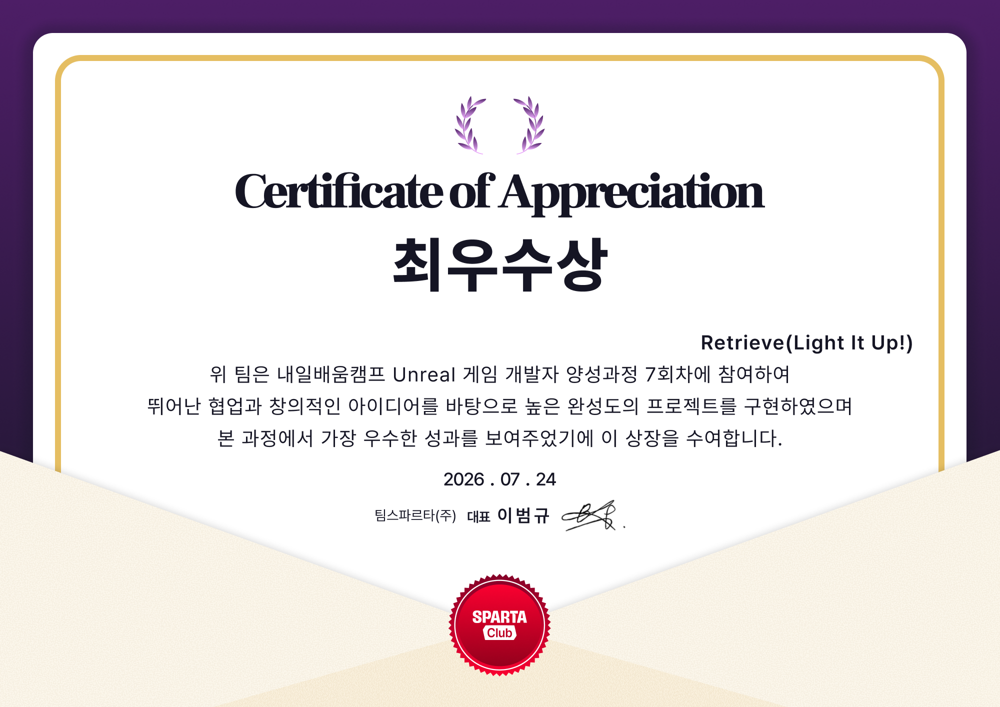

# ⚔️ Retrieve 🛡️

**Unreal Engine 5.7 · C++ · 3인칭 라이트 소울 액션 RPG**

**[🎮 Gameplay Video](https://youtu.be/IbsK5uPayGU)** · **[📦 Download (Playable Build)](https://drive.google.com/drive/folders/1gWEDqY4iO4_bXKTsiyoinOXSxnEa5IS0)**

> **잠에서 깨어나, 흩어진 원소를 되찾고, 철의 역병을 끝내라.**

**🏆 NBC Unreal 7th 최우수 프로젝트**

---

## 📑 Table of Contents

- [📖 Overview](#-overview)
- [👥 Team](#-team)
- [⚔️ Core Systems](#-core-systems)
- [🎮 Controls](#-controls)
- [🛠 Tech Stack](#-tech-stack)

---

## 📖 Overview

**Retrieve**는 오랜 잠에서 깨어난 마지막 영웅의 이야기입니다. 동료 루멘과 함께 흩어진 세 원소를 되찾고, 세계를 좀먹는 **철의 역병**을 끝낼 여정을 시작하세요. 하나로 이어진 세계를 자유롭게 누비며 침식된 세 명의 수호자를 쓰러뜨리고, 무기와 원소를 조합하여 자신만의 전투를 만들 수 있습니다.

| | |
|---|---|
| **장르** | 3인칭 라이트 소울 액션 RPG |
| **플랫폼** | Windows |
| **엔진** | Unreal Engine 5.7 |
| **언어** | C++ / Blueprint |
| **플레이타임** | 약 3~4시간 |
| **개발 기간** | 9주 |
| **팀** | 8명 |

---

## 👥 Team

| 담당 파트 | 이름 |
|---|---|
| 게임플로우 · 퀘스트 · AI | 장유진 |
| 전투 · GAS · 무기 · Git | 박하민 |
| 전투 액션 · 락온 · 보스 | 윤기상 |
| 원소 시스템 · 사운드 · UI | 이병헌 |
| 애니메이션 · 캐릭터 디자인 · 레벨 디자인 | 정보원 |
| 몬스터 리드 | 정찬호 |
| UI · NPC · 보조 시스템 | 이희원 |
| 레벨 디자인 · 시네마틱 | 이현진 |

---

## ⚔️ Core Systems

### 🗡️ 전투

무기별 콤보와 회피, 가드, 패리를 GAS로 엮은 리듬형 근접 전투입니다. 공격은 트레이스로 피격을 판정하고, 맞은 대상은 방향과 강도에 맞는 반응을 재생합니다. 가드 중에는 피해가 줄고, 타이밍을 맞춘 패리는 반격 기회를 엽니다.

| 무기 | 분류 | 특징 |
|---|---|---|
| 검+방패 | 주무기 · 근접 | 표준 콤보, 가드·패리 |
| 지팡이 | 주무기 · 원거리 | 원거리 발사, 짧은 순간이동 |
| 활 | 보조무기 · 원거리 | 조준·차징 후 사격 |

### 🔥 원소 시스템

전투로 게이지를 채우고, 원소 모드를 바꿔가며 특수 기술을 사용합니다.

- **게이지 슬롯** — 슬롯 3칸을 차례로 채우고, 가장 오래된 것부터 소비합니다.
- **원소 모드 `1` `2` `3`** — 화염·물·바람 모드를 전환합니다. 각 원소 모드는 해당 지역의 수호자를 쓰러뜨리면 더욱 강해집니다.
- **버스트 `E`** — 슬롯을 전부 소비하여 강력한 스킬을 사용할 수 있습니다. 어떤 기술이 나가는지는 **장착한 무기와 현재 원소 모드**로 정해집니다.
- **흡수 `Q`** — 슬롯을 한 칸 소비하여 일정 시간 동안 버프를 얻습니다.
- **원소 공명** — 원소를 흡수하면 스택이 쌓이고, 스택의 조합에 따라 강력한 공명 버프가 발동합니다.

### 👾 몬스터 & 보스

상태 기반 AI로 순찰, 경계, 추적, 공격, 복귀, 사망을 오갑니다. 시야에 들어오면 경계 게이지가 오르고, 시선이 이어지면 추적으로 넘어갑니다. 지형에 가려 놓치면 다시 의심 상태로 돌아가 마지막 위치를 살핍니다.

| 등급 | 구성 |
|---|---|
| 일반 | 늑대, 언데드, 고블린 계열 |
| 에픽 | 강화 패턴을 가진 필드 정예 |
| 보스 | 지역별 침식된 수호자, 그리고 다단계 페이즈로 싸우는 최종 보스 **타락한 여왕** |

보스는 페이즈가 바뀔 때 연출과 함께 새로운 이동·공격 패턴을 가집니다.

### 🗺️ 월드 탐험

레벨 로딩 없이 World Partition으로 이어진 하나의 월드입니다. 튜토리얼 구간(동굴 → 숲 → 마을)을 지나 세 원소 지역을 자유롭게 탐험할 수 있습니다. 세 원소를 모두 되찾으면 최종 지역인 성의 봉인을 해제할 수 있습니다.

- 지역마다 다른 포스트 프로세스·음악·라이팅
- 모닥불에서 저장·리스폰 (휴식하면 필드 적이 다시 나타남)
- 나침반·웨이포인트, 안개가 걷히는 미니맵과 월드맵

### 📜 퀘스트 & 인카운터

진행은 **메인 퀘스트**와, 그와 별개로 즐기는 **인카운터** 두 갈래입니다.

**메인 퀘스트**는 루멘과 함께 스토리를 따라가는 큰 줄기입니다. 자동으로 수락되고 자동으로 넘어가며, 목표를 달성할 때마다 트래커와 시스템 메시지가 갱신됩니다. 세 수호자는 순서에 상관없이 공략할 수 있습니다. 현재 하나의 엔딩이 존재합니다.

| 스테이지 | 퀘스트 | 목표 |
|---|---|---|
| 1 | 오랜 잠에서 깨어나 (Waking from the Deep) | 루멘과 대화 → 동굴 밖으로 · *이동 튜토리얼* |
| 2 | 잊혀진 숲 (The Forgotten Forest) | 늑대 처치 → 원소 사용 → 모닥불 → 마을로 · *전투 튜토리얼* |
| 3 | 남겨진 이야기 (A Story Left Behind) | 마을 둘러보기 → 루멘과 대화 |
| 4-A | 침식된 수호자 · 화염 (The Corrupted Guardian, Fire) | 화염의 땅 → 화염 수호자 처치 → 불의 코어 → 원소 강화 |
| 4-B | 침식된 수호자 · 바람 (The Corrupted Guardian, Wind) | 바람의 땅 → 바람 수호자 처치 → 바람의 코어 → 원소 강화 |
| 4-C | 침식된 수호자 · 물 (The Corrupted Guardian, Water) | 물의 땅 → 물 수호자 처치 → 물의 코어 → 원소 강화 |
| 5 | 끝을 향해 (To the Edge) | 성의 봉인 해제 → 성내 탐색 |
| 6 | 가장 긴 인사 (Forty Thousand Days) | 성 내부 진입 → 루멘과 대화 |
| 7 | 앞으로 나아가라 (Forge Ahead) | 철의 역병을 끝내기 |

> Stage 4-A / 4-B / 4-C는 순서 자유. 세 원소를 모두 되찾아야 최종 지역 진입이 가능합니다.

**인카운터**는 메인 퀘스트와 상관없이 월드 곳곳에서 만나는 짧은 의뢰입니다. 각자 저장 상태와 골드·아이템 보상을 따로 가지며, 의뢰 → 진행 → 보고 → 완료 순으로 흐릅니다. 지금은 세 종류가 있습니다.

- **구출** — 붙잡힌 사람 주변의 적을 처치해 구해냅니다. 보상을 받고, 그 자리에 상인이 풀려나 상점을 엽니다.
- **분실 화물** — 잃어버린 화물을 찾아 의뢰인에게 돌려줍니다.
- **일반 의뢰** — 물건 회수, 몬스터 소탕, 특정 지점 도달, 아이템 수집.

### 🎒 인벤토리 & 제작

재료·장비·소모품을 인벤토리에서 관리하고, 모닥불 근처에서 제작합니다. 장비에는 세트 효과와 전설 진화가 있어, 특정 부위를 모으면 능력치가 크게 오릅니다.

- 카테고리 탭 인벤토리 (무기 · 장비 · 소모품 · 재료)
- 획득 시 커스텀 토스트와 재화 표시
- 제작 요약 팝업, 퀵슬롯

### 🖥️ UI & HUD

HUD는 MVVM(Model-View-ViewModel) 구조로 구성했습니다. 체력·원소 게이지·보스 체력바·퀘스트 트래커·데미지 표시가 각각 전용 뷰모델을 가지며, 값이 바뀌면 해당 위젯만 스스로 갱신됩니다. 설정에서 감도, FOV, 모션 블러, HUD 표시, 활 조준 방식, 키 리바인딩을 조절할 수 있습니다.

---

## 🎮 Controls

| 키 | 동작 |
|---|---|
| WASD | 이동 |
| Space | 점프 |
| Shift (홀드) | 달리기 |
| Shift (탭) | 회피 |
| Ctrl | 앉기 |
| 마우스 좌클릭 | 공격 |
| 마우스 우클릭 | 강공격 |
| R | 방어 |
| Tab | 락온 (타겟 고정) |
| 1 / 2 / 3 | 원소 모드 전환 (화염 / 물 / 바람) |
| Q | 버스트 |
| E | 강화 |
| V | 퀵슬롯 |
| F | 상호작용 |
| I | 인벤토리 |
| M | 월드맵 |
| K | 스킬 안내 |

---

## 🛠 Tech Stack

**엔진 · 언어**
- Unreal Engine 5.7
- C++17

**게임플레이**
- GAS · Enhanced Input
- Gameplay Tags · Gameplay Messages
- StateTree · GameplayStateTree
- Modular Gameplay

**애니메이션 · 캐릭터**
- Animation Blueprint (Linked Anim Layer)
- Motion Warping · Animation Warping
- Control Rig · IK Rig
- Animation Locomotion Library

**UI**
- UMG · MVVM(Model-View-ViewModel)

**환경 · 렌더링**
- Niagara
- PCG

**협업 · 배포**
- GitHub
- Git LFS
- Jira · Notion · Discord
